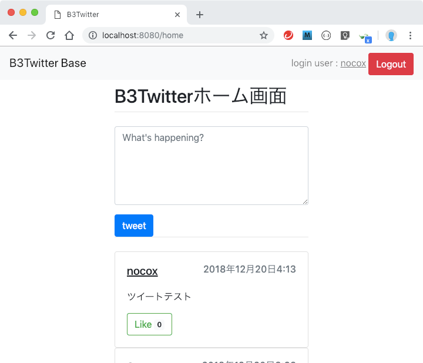
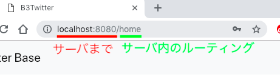

# チュートリアル１
> http://localhost:8080/home

上のURLでブラウザからアクセスすると以下のページが表示される(ログイン済)



このページが表示されるまでの処理を解説する。


## 1.urls
Webアプリケーションでは、アクセスしてきたURLに対して、特定の関数(動作)を実行することで、URLごとで違った振る舞いをすることができる。これをルーティングと呼ぶ。

ルーティングは、以下のファイルに記述されている。

**[ b3twitter/twitter_app/urls.py ]**
```Python
from django.urls import path
from . import views

urlpatterns = [
    path('', views.top, name='top'),
    path('home', views.home, name='home'),
    path('create_tweet', views.create_tweet, name='create_tweet'),
]
```
urlpatternsリスト内のpath関数がURLと関数の対応付を行っており、第1引数がURL、第2引数が関数である。

今回アクセスするURLの前半部分
"http://localhost:8080/"
は、ブラウザからサーバにアクセスするまでで使用する部分であり、Djangoサーバがルーティングで使用するのは、"home"の部分である。



したがって、urlpatternsの2番目の処理が選ばれ、"views.home"という関数が実行される。

> ここでは説明を省いているが、Djangoにおけるルーティング処理はアプリケーションごとで行うため、複数のファイルで行っている。

## 2.views
"views.home"関数のコードは、"views.py"に記述されている。

**[ b3twitter/twitter_app/views.py ]**
```Python
# ~ 省略 ~
@login_required
def home(request):
    tweets = Tweet.objects.all().order_by("created_at").reverse()
    tweet_form = TweetForm(None)
    queries = {'tweets': tweets, 'tweet_form': tweet_form}
    return render(request, 'twitter_app/home.html', queries)
# ~ 省略 ~
```

ここで記述されている処理を行い最終的にhtmlファイルをブラウザに返す。


## 3.models
Djangoでは、データベースとの連携をPythonのコードのみで行うことができる仕組み(ORM)が用意されている。
Tweetモデルもデータベースに格納されたツイートデータを扱うものである。

Tweetモデルは、以下のファイルで詳細が記述されている。

**[ twitter_app/models.py ]**
```Python
# ~ 省略 ~
class Tweet(models.Model):
    user = models.ForeignKey(User, on_delete=models.CASCADE)
    content = models.CharField(max_length=240)
    created_at = models.DateTimeField(auto_now_add=True)
    likes = models.ManyToManyField(User, blank=True, related_name='post_likes')

    def __str__(self):
        return self.content
```

今回のtweetモデルでは、以下の情報が格納されている
  - user        : ツイートを投稿したユーザ情報
  - content     : ツイート内容
  - created_at  : ツイートした日付
  - likes       : このツイートを"いいね"したユーザリスト


view.home関数の最初の処理は、データベースに格納されているすべてのツイート情報を日付が新しい順に並べ替えて取得している。
```Python
tweets = Tweet.objects.all().order_by("created_at").reverse()
```

このように、データベースから必要なデータを取得することができる。

## 4.templates
ブラウザに返すhtmlファイルを生成します。

views.home関数で取得したデータなどをhtmlに埋め込む仕組みが、render関数で用意されている。
views.home関数では、以下のように実行している。
```Python
queries = {'tweets': tweets, 'tweet_form': tweet_form}
return render(request, 'twitter_app/home.html', queries)
```
第2引数で、埋め込み先のhtmlファイルを指定し、第3引数に埋め込むデータを格納する。


次に、埋め込み先のhtmlファイルを解説する。
以下に、ツイート関連を表示するテンプレートである。

**[ twitter_app/templates/twitter_app/home.html ]**
```html
<!-- 省略 -->
<div id="tweets">
    
    <div class="card">
      <div class="card-body">
        <div class="card-title" style="display: flex">
            <h5><u>{{ tweet.user.username }}</u></h5>
            <h6 class="text-muted" style="margin-left: auto">{{ tweet.created_at }}</h6>
        </div>

        <p class="card-text">{{ tweet.content }}</p>

        
        <button id="like-btn"
                data-url=""
                class="card-link btn btn-success">
            <span>Liked</span>
            <span class="badge badge-light">{{ tweet.likes.count }}</span>
        </button>
        
        <button id="like-btn"
                data-url=""
                class="card-link btn btn-outline-success">
            <span>Like</span>
            <span class="badge badge-light">{{ tweet.likes.count }}</span>
        </button>
        

      </div>
    </div>
    
</div>
<!-- 省略 -->
```
"","{{}}"は、通常のhtmlファイルには、存在しない記述であり、Djnagoのテンプレートとして使う場合に用いられる記述方法である。
上記の特殊な記述を行うと、その内部では、pythonに似たコードを記述できる。

このテンプレートを使うことで、複数のツイートを並べて表示することができる。
