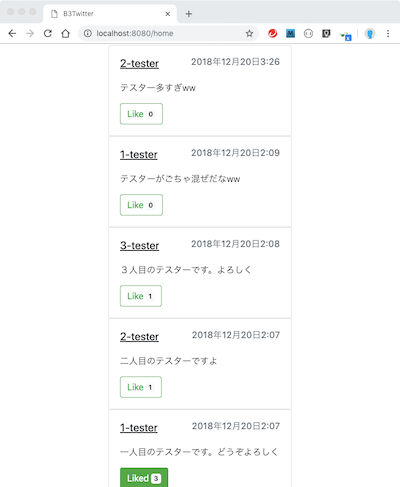

# チュートリアル2
> 機能を追加する課題で実装方法を確認

## 追加機能の概要
現在は、複数のユーザのツイートがごちゃ混ぜで表示されている。


home画面からユーザ名をクリックすると、そのユーザが投稿したツイートとユーザ情報を表示するプロフィールページを新たに作成する。


## 1.ルーティングの追加
まずは，urls.pyを編集して，プロフィールページへのルーティングを追加する。

今回の追加する機能では、各ユーザ専用のプロフィールページを表示する必要がある。
そのため、urls.pyでは以下のように記述する．

**[ b3twitter/twitter_app/urls.py ]**
```python
from django.urls import path
from . import views

urlpatterns = [
    path('', views.top, name='top'),
    path('home', views.home, name='home'),
    path('create_tweet', views.create_tweet, name='create_tweet'),
    path('profile/<str:user_name>', views.profile, name='profile') # 追加
]
```

新たに追加したルーティングの、'\<str:user_name>'の部分は、ここに何らかの文字列型が入ったらルーティングし、その際にその文字列をuser_nameという名前で引数に割り当てる。
したがって，ユーザ名"tester"のプロフィールページに遷移する場合は以下のURLになる．
> http://localhost:8080/profile/tester

指定したユーザ名は，この後作成する"views.profile"関数の引数として受け取ることができる．


## 2.動作の追加
次に，プロフィールページにアクセスした際の動作をviews.pyにprofileという関数で追加する。


**[ b3twitter/twitter_app/views.py ]**
```Python
# Userモデルを使用するので追加
from .models import User

# ~ 省略 ~
# 以下の関数を追加
def profile(request, user_name):
    target_user = User.objects.filter(username=user_name).first()
    if target_user:
        tweets = Tweet.objects.filter(user__username=target_user.username).order_by("created_at").reverse()
        queries = {'target_user': target_user, 'tweets': tweets}
        return render(request, 'twitter_app/profile.html', queries)

    return redirect(home)
```

今回の関数は上から，以下のような手順で行う。
1. 引数で受け取ったユーザ名を用いてユーザ情報を検索し，target_userに格納
2. 与えられたuserが存在することを確認 (存在しなければ，target_user = None)
3. ユーザがツイートした情報をusernameを用いてTweetモデルから検索し，tweetsに格納
4. ターゲットユーザとツイート情報をクエリーに格納
5. テンプレートと組み合わせて返す


## 3.テンプレートの作成と再利用
テンプレートでは，home.htmlで使われていた，受け取ったツイートを全て表示する機構がそのまま再利用できる．

以下の部分をtweets.htmlとう新しいhtmlファイルを生成しhome.htmlからは，上記の機構を削除する．

**[ b3twitter/twitter_app/templates/tweets.html ]**
```html
<div id="tweets">
    
    <div class="card">
      <div class="card-body">
        <div class="card-title" style="display: flex">
            <h5><u>{{ tweet.user.username }}</u></h5>
            <h6 class="text-muted" style="margin-left: auto">{{ tweet.created_at }}</h6>
        </div>

        <p class="card-text">{{ tweet.content }}</p>

        
        <button id="like-btn"
                data-url=""
                class="card-link btn btn-success">
            <span>Liked</span>
            <span class="badge badge-light">{{ tweet.likes.count }}</span>
        </button>
        
        <button id="like-btn"
                data-url=""
                class="card-link btn btn-outline-success">
            <span>Like</span>
            <span class="badge badge-light">{{ tweet.likes.count }}</span>
        </button>
        

      </div>
    </div>
    
</div>

<script>
    $("#tweets").on("click", "#like-btn", function (event) {
        event.preventDefault();
        var this_ = $(this);

        this_.prop('disabled', true);
        $.ajax({
            url: this_.attr("data-url"),
            type: 'GET'
        }).done(function (data) {
            var like_count = Number(this_.children("span:last").text());
            if (data.is_liked){
                this_.removeClass().addClass("card-link btn btn-success");
                this_.children("span:first").text("Liked");
                this_.children("span:last").text(like_count+1);
            }else{
                this_.removeClass().addClass("card-link btn btn-outline-success");
                this_.children("span:first").text("Like");
                this_.children("span:last").text(like_count-1);
            }
            this_.prop('disabled', false);
        }).fail(function (data) {
            console.log('like api error');
            alert('Like処理に失敗しました．ログインしていますか？');
            this_.prop('disabled', false);
        });
    })
</script>
```

"tweets.html"は以下のように記述することで、別のhtmlファイルに埋め込むことができる。
```html

```

編集した"home.html"は以下のようになる。

**[ b3twitter/twitter_app/templates/twitter_app/home.html ]**
```html



    <h1 class="mt-2">
        <div style="display: flex">
            <h3>login user : </h3>
            <h3 style="font-weight: bold;">{{ request.user }}</h3>
        </div>
    </h1>
    <hr class="mt-0 mb-4">

    
    <form action="" method="post">
        
        {{ tweet_form|crispy }}
        <button type="submit" class="btn btn-primary" id='tweet-btn'>tweet</button>
    </form>
    <hr class="mt-0 mb-4">

    <!-- 以下を追加 -->
    

```

今回新たに作成するプロフィールページのテンプレートは"profile.html"として以下のように記述する．

**[ b3twitter/twitter_app/templates/twitter_app/profile.html ]**
```html



    

    <h1 class="mt-2">
        <div style="display: flex">
            <h3 style="font-weight: bold;">{{ target_user.username }}</h3>
            <h3> のプロフィール </h3>
        </div>
    </h1>
    <hr class="mt-0 mb-4">

    <!-- tweetを表示する機構を再利用 -->
    

```

> この状態で，以下のURLにアクセスすることで動作を確認できる．<br>
> http://localhost:8080/profile/[ユーザ名]


## 4.aタグを使ったリンク付け
最後にhtmlにaタグを使ってプロフィールページのリンクを追加する．


aタグのhref属性は、Djangoで用意されてるURLの記述方法に従い以下のようにする。
```html
<a href=""></a>
```

**b3twitter/twitter_app/templates/tweets.html**
```html
<div id="tweets">
    
    <div class="card">
      <div class="card-body">
        <div class="card-title" style="display: flex">
            <h5>
                <!-- 変更箇所 -->
                <a href="">
                    <u>{{ tweet.user.username }}</u>
                </a>
            </h5>
            <h6 class="text-muted" style="margin-left: auto">{{ tweet.created_at }}</h6>
        </div>
<!-- 以下省略 -->
```
